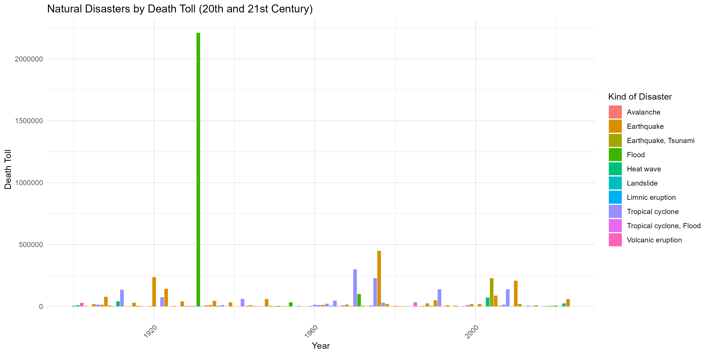

The graph offers a comprehensive view of the toll inflicted by different natural disasters like earthquakes and floods. It's like a story divided into two parts: one covering the 1900s until 2000 (the 20th century), and the other from 2000 until today (the 21st century).

In the first part, there are lines that represent each kind of disaster. Think of them as different storylines. The height of each line shows how many people were affected in a particular year. If a line is high, it means a lot of people were impacted that year. Moving to the second part, it's the continuation of the story from 2000 onwards. The lines are still there, each representing a disaster type, and their height shows how many people were affected each year.

However the above graph by itself is not very useful due to the highly disproportionate casualty numbers which occur each year, with some years which have very casualty numbers and some years having much lower casualties. Hence we look at the log-transformed data which is useful in our case!

Some important features of the graph come through. The clustered nature of the graph, with similar colors frequently occurring in proximity, reveals an underlying pattern that warrants examination. This clustering signifies instances where specific types of natural disasters, represented by the same colors, have occurred in succession or concurrently over certain periods. Such occurrences can suggest either regional trends or cyclical patterns in the occurrences of these events. The inherent wave like pattern in the graph is also interesting!

This graph helps us understand the history of natural disasters and their impact on people's lives. It's a way to learn from the past and reminds us to work together to reduce the effects of these events in the future.

