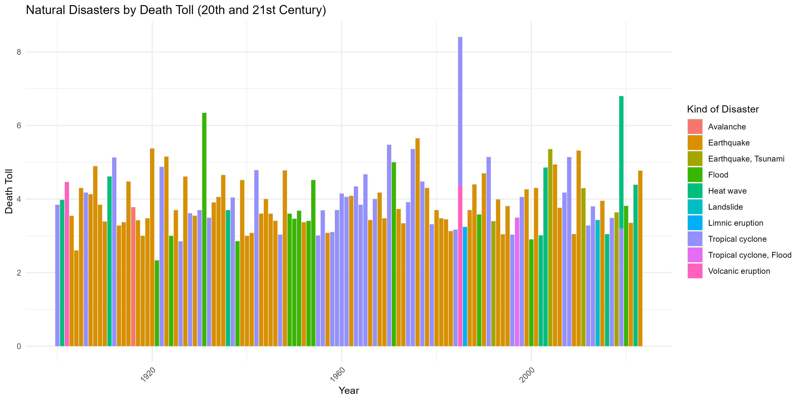

# jhuplacementassignment

The graph offers a comprehensive view of the toll inflicted by different natural disasters like earthquakes and floods. It's like a story divided into two parts: one covering the 1900s until 2000 (the 20th century), and the other from 2000 until today (the 21st century).

In the first part, there are lines that represent each kind of disaster. Think of them as different storylines. The height of each line shows how many people were affected in a particular year. If a line is high, it means a lot of people were impacted that year.

Moving to the second part, it's the continuation of the story from 2000 onwards. The lines are still there, each representing a disaster type, and their height shows how many people were affected each year.

The colors of the lines help us tell which disaster is which. The graph lets us see changes over time. If a line goes up, it means more people were affected that year. If it goes down, fewer people were affected.

This graph helps us understand the history of natural disasters and their impact on people's lives. It's a way to learn from the past and reminds us to work together to reduce the effects of these events in the future.

